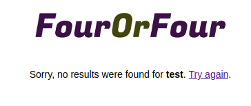
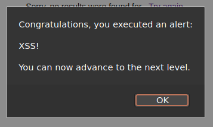
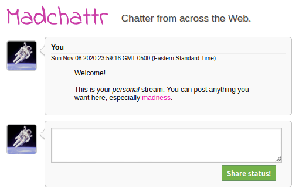
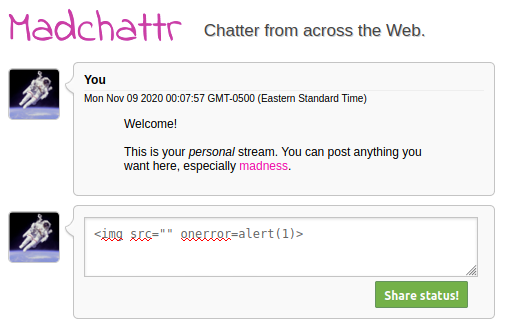

# Cross-Site Scripting (XSS)

## Overview

### What You'll Learn
In this section, you'll learn
1. What XSS is
3. How to perform an XSS attack (**on sites that you are explicitly given permission to do so**)
4. How to prevent XSS vulnerabilities in applications

### Prerequisites

*Optional:* Basic knowledge of HTML frameworks and web security -- this is not required but might help with your understanding!

### Introduction

XSS is one of the most prevalent vulnerabilities on the web -- let's learn more about what it is, how to find it, and how to fix it!

## What is XSS?

XSS attacks allow attackers to execute arbitrary JavaScript code within the context of a victim's browser session. You might say "Dude, I don't care if they can get into my browser," but that level of access can have tremendous impacts! If you fall victim to an XSS attack while on your bank's website, attackers may:

* Take over your account (by resetting your password from an account settings menu)
* Transfer funds as they wish
* Turn on your webcam/microphone/etc.
* Get your location

...and so on. XSS is no joke.

### Types of XSS

XSS comes in three main varieties:

* **Reflective XSS** - Exploited by adding a payload to a link; triggered when a victim opens the link
* **Stored XSS** - Exploited by the web server storing a payload in its databases; triggered when a victim visits an affected page
* **Document Object Model (DOM) XSS** - Any XSS that involves abusing the structure of the JavaScript DOM (not covered)

We'll get examples of the first couple as we go through some exercises later!

## How does XSS work?

XSS can happen whenever a website allows untrusted (read: arbitrary) user input to be interpreted as HTML code or JavaScript. This can happen on the client side of the website via vulnerable JavaScript code (e.g. practically any code that allows user input to go to `eval()`), and it can also happen on the server side (e.g. saving a piece of text from a user, and including it as HTML in a later response). **Any time the website lets the user control some part of the page without restriction, there's XSS.**

## Examples and Practice

For these examples, we'll be using Google's XSS Game. Feel free to check out the normal version of it [here](https://xss-game.appspot.com/).

### Reflected XSS via Query String Parameter

To start, head over to the first exercise here: https://xss-game.appspot.com/level1/frame

You should see something like this:

Notice that we have some direct user input on this page -- the search bar.

Let's throw something in there and see how the web page reacts. In this case, we entered "test":

Ooh, interesting -- we can see that our text from the search gets echoed back to us on the results page. Let's see if we can get some JavaScript going here:

Once we press enter, we should hopefully see an alert box pop up!

This proves that we've got arbitrary JavaScript execution. Now, you might say "Hey, dude, why do I care if I can pop up an alert box on my own browser?", and that'd be a good question. If you look up at the URL, you'll notice that our search query is kept up there:

This means that whatever code you write between the `` into the chat. This is definitely a good idea, but sadly, that won't work here.

There are *many* different kinds of triggers for XSS -- like, [at least a few hundred](https://portswigger.net/web-security/cross-site-scripting/cheat-sheet). Sometimes, websites will be great at blocking against some kinds of triggers, like pure `<script>` tags, but not against things like ``. This payload tries to load an image from an empty source URL, and tells the page to run `alert(1)` if an error occurs (which it will, since the source is invalid).

Let's try this against our chat program!

Now, this wouldn't be trivial to find -- there are many triggers to attempt, and usually one would use a program like Burp Suite to automate brute-forcing payloads. Let's press enter to see our reward:

The cool part about a stored XSS attack like this is that if you refresh the page, you'll be presented with the error again. You don't have to do anything special to be a victim of a stored XSS attack -- just visiting the page normally is enough to trigger the payload.

## Protecting Against XSS

To protect against XSS, there are a variety of techniques:

* **Avoid using vulnerable functions like `eval()`** - These usually provide open wounds for attackers to exploit
* **Escape dangerous characters before returning content** - A `<` character in HTML is treated differently than an `<` character in text -- encoding dangerous characters can avoid them being treated like code

For more info on preventing XSS, check out the Open Web Application Security Project (OWASP) [XSS Prevention Cheat Sheet](https://cheatsheetseries.owasp.org/cheatsheets/Cross_Site_Scripting_Prevention_Cheat_Sheet.html)!

## Further Resources

We highly recommend checking out **[PortSwigger's Web Security Academy](https://portswigger.net/web-security)** -- they have amazing tutorials on web security vulnerabilities from XSS to SQL to CSRF and beyond!
